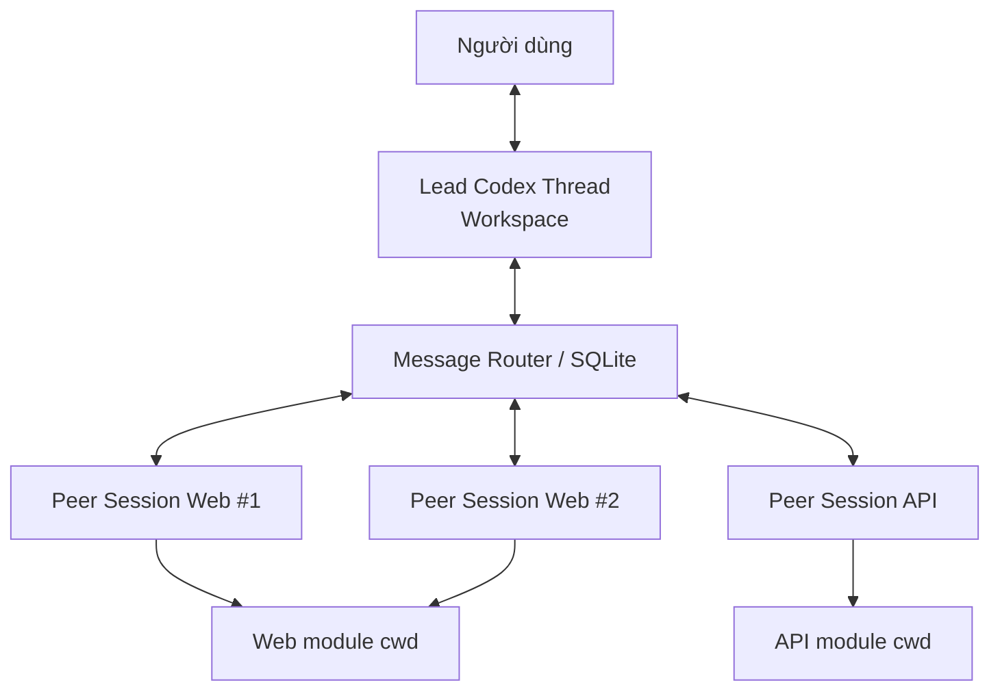
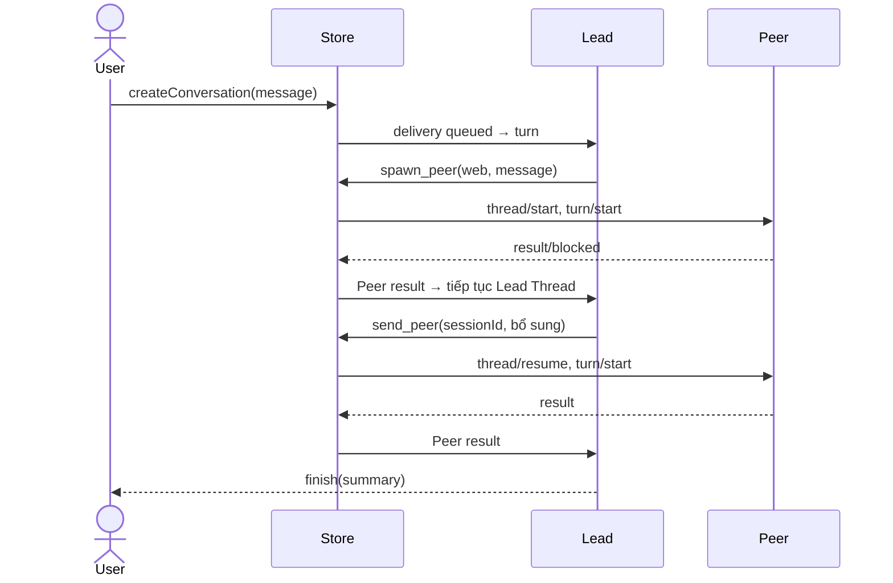

# Kiến trúc Agent Communication Runtime

```mermaid
flowchart TD
  U["Người dùng"] <--> L["Lead Codex Thread<br/>Workspace"]
  L <--> R["Message Router / SQLite"]
  R <--> P1["Peer Session Web #1"]
  R <--> P2["Peer Session Web #2"]
  R <--> P3["Peer Session API"]
  P1 --> W["Web module cwd"]
  P2 --> W
  P3 --> A["API module cwd"]
```

Không có Peer-to-Peer, các Peer không nhìn thấy danh sách session khác trừ thông tin Lead chủ động chia sẻ.

## Trách nhiệm

- `apps/api/src/index.ts`: HTTP API, localhost-only, SSE, bootstrap.
- `apps/api/src/coordination-store.ts`: SQLite snapshot transaction cho Conversation/Session/Message/Delivery; khôi phục sau crash.
- `apps/api/src/coordinator.ts`: hàng đợi tin nhắn, giữ tối đa bốn Codex turns đồng thời (giới hạn tài nguyên, không phải quality gate); đảm bảo tối đa một turn đang chạy trên cùng session.
- `apps/api/src/codex-runtime.ts`: transport gọi `thread/start`, `thread/resume`, `turn/start` và nhận JSON-RPC notifications.
- `apps/api/src/lead-protocol.ts`: parse câu trả lời Lead thành reply và các action định tuyến. Không kiểm tra nội dung file hoặc đánh giá chất lượng.
- `apps/web/src/main.tsx`: hội thoại người dùng với Lead, danh sách Peer sessions và transcript chỉ đọc.

## Luồng

```mermaid
sequenceDiagram
  actor User
  participant Store
  participant Lead
  participant Peer
  User->>Store: createConversation(message)
  Store->>Lead: delivery queued → turn
  Lead->>Store: spawn_peer(web, message)
  Store->>Peer: thread/start, turn/start
  Peer-->>Store: result/blocked
  Store->>Lead: Peer result → tiếp tục Lead Thread
  Lead->>Store: send_peer(sessionId, bổ sung)
  Store->>Peer: thread/resume, turn/start
  Peer-->>Store: result
  Store->>Lead: Peer result
  Lead-->>User: finish(summary)
```

## Trạng thái kỹ thuật

`Conversation`: `active | finished`. `AgentSession`: `idle | running | interrupted`. `Delivery`: `queued | running | completed | interrupted`.

Phân biệt trạng thái **Delivery**, không áp dụng `accept/rework/pass` do Backend đánh giá. Lead có thể tiếp tục các Peer bao nhiêu lần cũng được.

`completeLead()` commit atomically kết quả Lead và các deliveries mới. `completePeer()` commit kết quả Peer và message tới Lead. Chỉ Lead được tạo/gửi Peer messages. `Coordinator` thực thi các delivery đang `queued` và không chạy song song hai turn cùng session. Multiple Peer sessions trong cùng module **có thể** chạy đồng thời, có nguy cơ cùng ghi file.

Sau crash, các delivery `running` chuyển sang `interrupted` và **không replay**; session lưu `threadId` để các lượt tiếp theo có thể resume. Old workflow DB không được import sang `coordination.sqlite`.

## Codex boundary

Lead `cwd=lead.cwd`, sandbox read-only. Peer `cwd=modules[].path`, mặc định YOLO (`danger-full-access`); App không dùng worktree. Hướng dẫn mô hình Peer không gửi message trực tiếp đến Peer khác là **ràng buộc routing**, không phải OS security boundary. Reviewer chỉ có thể được thêm sau này như một Agent được Lead chủ động gọi; không gate bắt buộc.

Các kết quả Codex được hiển thị trung thực, không giả test pass; End-to-end với Codex thật phải xác minh trên máy cài Codex.

## Phục hồi lỗi JSON envelope của Lead

`parseLeadResponse()` chỉ kiểm tra cú pháp của action routing, không đánh giá nội dung công việc. Nếu Lead gửi malformed JSON chứa `commands` hoặc `spawn_peer`, hàm trả `LeadProtocolError`. `Coordinator.execute()` sẽ resume chính Lead Codex Thread để yêu cầu sửa định dạng một lượt, **chưa gửi message cho Peer**. Sau hai lượt thất bại, app đánh dấu Delivery là `interrupted` và thông báo cho người dùng. Một câu trả lời Lead bằng văn bản thường không chứa action intent vẫn được chấp nhận làm `reply`, không phát sinh gate.

Regression test: hợp đồng API Todo chứa JSON lồng trong message dành cho Peer Web; Lead gửi JSON lỗi, tự sửa lại, Peer Web thật sự được tạo và nhận message; nếu cả hai lượt sai thì không tạo Peer giả.

## Dynamic tools — điều phối không cần viết JSON bằng tay

`CodexClient.initialize()` opt-in `capabilities.experimentalApi=true`. `CodexAgentRuntime` đăng ký `leadDynamicTools` trên `thread/start` đối với Lead, không đăng ký cho Peer. Khi Codex gửi server request `item/tool/call`, runtime kiểm tra Thread và action arguments, sau đó gọi `CoordinationStore.routeLeadTool()`. Tool actions `spawn_peer`/`send_peer`/`finish` được commit trong SQLite cùng mã `callId` trước khi `CodexClient.respond()` trả `contentItems` cho Agent. Nếu Codex lặp `callId`, không tạo Peer/message trùng. User vẫn được xem các trao đổi qua transcript.

`Coordinator.execute()` không parse và dispatch thêm JSON trong agent reply khi đã có tool call thành công. Các lượt Lead Thread cũ chưa có tools nhận `turn/start.outputSchema` để đảm bảo cú pháp JSON; nếu output vẫn malformed, app cho một lần sửa cú pháp. Giao thức vận chuyển này **không kiểm tra chất lượng kết quả Peer** và không thêm approval gate.

Codex hiện chỉ ghi nhớ dynamic tool registry khi `thread/start`; `thread/resume` tải các công cụ đã lưu chứ không tự cài công cụ mới cho Thread cũ. Vì vậy để thử tool calls, tạo một Conversation mới; để tiếp tục Todo đang dở, gửi tiếp message trong Conversation hiện tại (legacy JSON schema).
